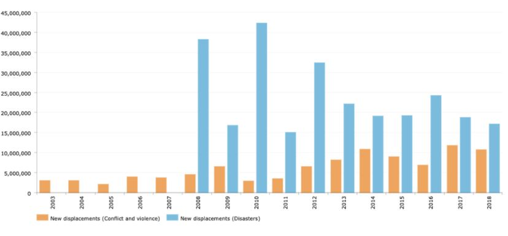

## Assignment 3 & 4: Critique by Design

## Original Chart

 This original chart presents data on newly displaced people around the world with two catgories. The catgories include newly displaced people due to conflict & violence and due to disasters. The chart lacks clarity as it does not make entire sense at first glance. Only with reading the article that came along with the chart did I understand that what the chart was trying to convey. The article explains "While the UN and its supporting bodies have made an effort to expand international protection of refugees, the definition on the status of refugees remains largely untouched since its initial applications in 1951 and 1967. 'While not in themselves causes of refugee movements, climate, environmental degradation and natural disasters increasingly interact with the drivers of refugee movements'"(Alfonso). 

The main point of the chart is to showcase the information that newly displaced people or refugees overwhelmingly display people affected by natural enviormental disasters. International law recognizes refugees pertaining mainly to conflict and violence, but the chart showcases the how conflict and violence causes less human displacement than enviromental disasters. This leads me to understand that the audience for this chart needs to have some background in the policies concerning displaced people. 

The first thing that stood out was the lack of a title. The lack of the title made it hard to get the general gist of the graph and what it was trying to display. The Y-axis also shows numbers and these numbers are not noted to have any type of measurement. The measurement also looks to need some type of horizontal gridline in order to get closer understanding of the numbers of the two different groups of displaced people. I also saw the redundancy seen with the term "new displacements" which can be solved with ading context to a new title. 

##### Source: Alfonso, Alejandro. Climate Refugees will raise, nations should find the way for shelter them. Universidad de Navarra, 2019.

## First Edits

This is my first edit that includes a title, the elimination of redundancy, a unit of measurement, and new color scheme. I think that this chart makes more sense as it showcases the general gist of the chart to the audience. 

## Testing My Solution

In order to get an outside view of the new edit, I reached out to a friend who has a background as a senior undergraduate with a Political Science background. I also reached out to a freshman undergraduate with a Buisness background. Their response helped shaped how to fix the chart to be more readable. 

#### Senior Response

#### - Can you tell me what you think this is?
This is a study of refugee counts and the reasons. 

#### - Can you describe to me what this is telling you?
That environmental refugees have seen a decline while refugees of war have remained within a consistent range.  

#### - Is there anything you find surprising or confusing?
 Immediately, that there is a decline in environmental refugees based on what we know about the climate crisis, and the increasing frequency and damage by climate related environmental disasters. 

#### - Who do you think is the intended audience for this?
 I’d assume those involved in anti-climate policy and refugee work or who may be looking to spread false or misleading information. 

#### - Is there anything you would change or do differently?
 Including events corresponding to the years (2008-2020) would be helpful to clarify what this is trying to display.

#### Freshman Response

#### - Can you tell me what you think this is?
It shows people who are displaced because of conflicts and enviromental disasters.

#### - Can you describe to me what this is telling you?
That there are more eniviromental refugees than other refugees.

#### - Is there anything you find surprising or confusing?
I hear about wars and always thought refugees mainly came from the conflict group of displaced people, but there are many enviromental displaced people. 

#### - Who do you think is the intended audience for this?
I think it is mainly for people working with finding solutions to displaced people.

#### - Is there anything you would change or do differently?
I would like to know what the difference between displaced people and refugees, or are they the same? 

## Final Chart

#### explanation 

