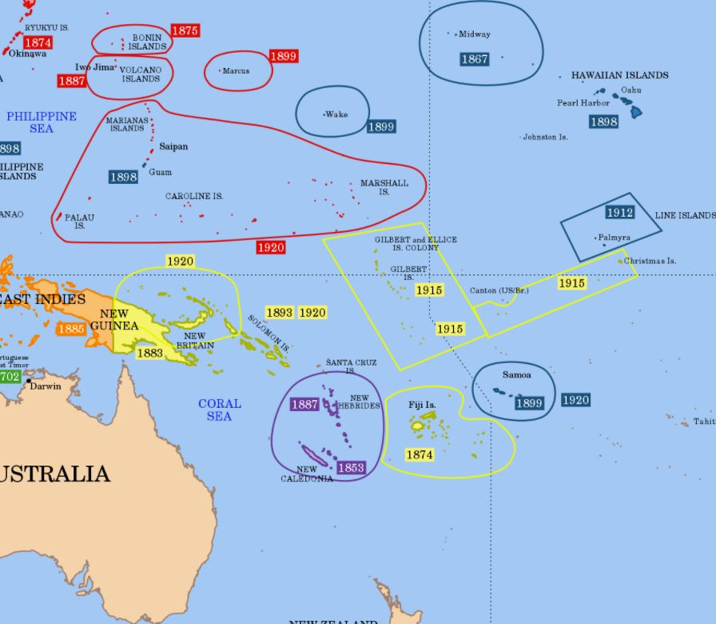
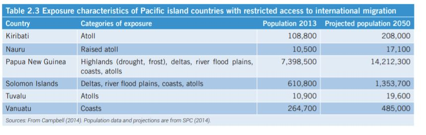
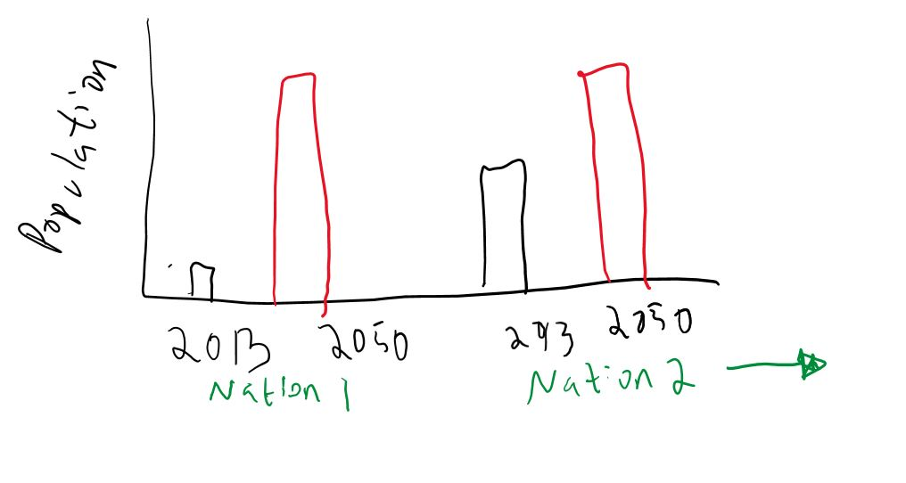
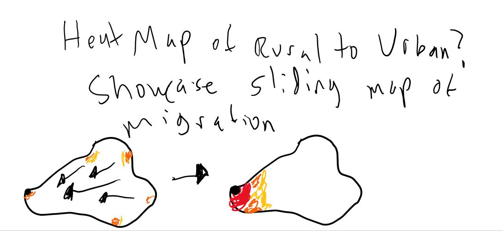
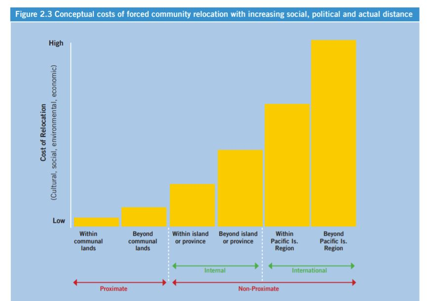

# Final Project

# Ensuring the Recognition and Path Foward for Climate Refugees

## Project Summary: 

Pacific Climate refugees (Pacific population that are displaced due to long term environmental
effects of climate change are not incorporated in international law and face legal hurdles. 
It is important to show the increased severity of the issue and to explain why proactive measures 
may are necessary but may bring beneficial aspects to host countries. 

# Outline and Initial Sketches 

## 1. Introduction

I want to first set the stage to my project. The project focuses on Pacific Island Nations 
that are not well known to the world. It is important to set up an introduction in which a map along
with information on the people living in these islands will face in the upcoming years. Here I would 
like to add a map indicating the nations like Tuvalu, Nauru, Kiribati, and other Pacific Island Nations 
who will face environmental impact which eventually leads to displacement.

## 2. Climate Impact 
In this section I want to include data from the United Nations Economic and Social Commission 
for Asia and the Pacific that offers an understanding of what effects are being felt in some 
vulnerable nations. Events like increased cyclones, sea level rise, flooding, drought, saltwater 
intrusion, etc. They will be presented to showcase the increased dire situation populations will face.

## 3. Population Increase 
This section will showcase over time the growth of population of the islands that will be severely 
affected. I think this will add context in why proactive measures will help save more lives than 
waiting until the population has ballooned and are in the middle of the final stages of climate 
displacing entire island populations. 

## 4. Urban Migration

In this section I want to showcase how prior to displacement off the entire island, internal migrations 
from rural to urban areas pose high threats to infrastructure, health, etc that are leaving these islanders 
with no space. This is pushing people off the islands, but with no legal way to migrate or no ability to be 
counted as refugees, people are stuck. The increase of urban population may be best to be presented with a 
slider that offers the moves of populations from rural to urban areas in some of these nations. 

## 5. Costs 

This section will showcase the cultural, social, psychological, and economic costs associated with Climate Refugees.
As displaced populations shift from rural to urban to neighboring islands to neighboring major countries like
Australia, USA, and New Zealand costs go up. People lose their homes, their source of economic, cultural laws
and practices. 

This section allows for the readers to realize that there are more things at stake for these people. 
It is important to ensure ways to migrate that preserves the diginities of the populations at risk.

## 6. Benefits to Migration

This section is in progress. I want to showcase data that will indicate how increase of refugees can 
economically benefit host nations that take in refugees. These would come fro, examples in Europe or Canada 
or NZ etc where refugees have had positive impacts. This should be enforced to qualm the fears of host nations 
who have people who doubt the benefits of migration.

# The Data 

The majority of datasets that will be used are pulled from Secretariat of the Pacific Community accessible 
data that offers population, urbanization, environmental impact, etc on many Pacific Nations.

https://pacificdata.org/data/dataset

They stem from data presented in the Pacific Climate Change and Migration (PCCM) Project called “Enhancing the Capacity of Pacific Island Countries to Manage the Impacts of Climate Change on Migration”. It was created by the United Nations Economic and Social Commission for Asia and the Pacific, the International Labour Organization, and the United Nations Development Programme.

https://www.ilo.org/dyn/migpractice/docs/261/Pacific.pdf
https://i.unu.edu/media/ehs.unu.edu/news/11747/RZ_Pacific_EHS_ESCAP_151201.pdf 

# Method and Medium

My plan is to use Esri’s Story Maps. The main image I want to get across is the increased danger certain Pacific Islands face due to climate change. In this medium I am able to take the outline and include data and maps to showcase the importance of proactive policy measures.

The Story Map will allow easy uploading of this data while keeping a succinct and interactive model that presents the story arch. I would like to add information to the side with an explanation and more information than just the data illustrations presented. 

